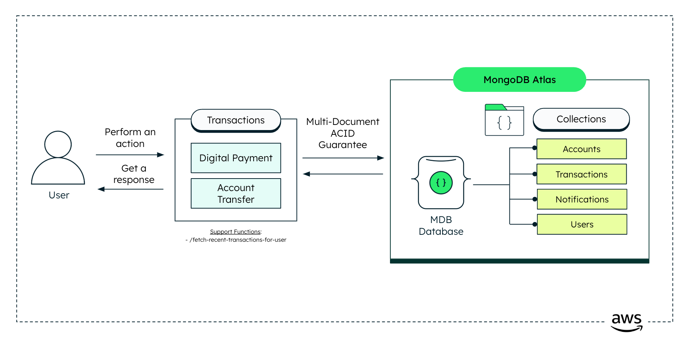

# Leafy Bank Transactions Service (Backend)

This repository powers the backend for Leafy Bank, handling digital payments and account transfers. It utilizes MongoDB to ensure secure and efficient transaction processing, providing APIs for seamless integration.

## Where Does MongoDB Shine?

MongoDB excels in managing complex operational data, making it an ideal choice for financial services that require robust transaction processing.

### The 4 Pillars of the Document Model

1. **Easy**: [MongoDB's document model](https://www.mongodb.com/resources/basics/databases/document-databases) aligns naturally with object-oriented programming, using BSON documents similar to JSON. This design simplifies managing complex data structures such as users, accounts, transactions and notifications, facilitating feature implementation with greater ease.

2. **Fast**: By adhering to the principle of "Data that is accessed together should be stored together," MongoDB optimizes query performance. This principle ensures that related data can be quickly retrieved in unison, enhancing overall service speed—an essential factor for financial applications demanding rapid access to operational data.

3. **Flexible**: MongoDB's schema flexibility allows data models to evolve effortlessly alongside changing business requirements. This adaptability enables financial services to update operational data models—such as transaction and account structures—without expensive, time-consuming schema migrations, thus avoiding costly downtimes typically associated with schema changes.

4. **Versatile**: The document model in MongoDB seamlessly handles diverse data types, including strings, numbers, booleans, arrays, objects, and even vectors! This versatility supports a wide range of operational use cases, enabling comprehensive management of users, accounts, transactions, and notifications seamlessly within your application.

### Multi-Document Transaction Guaranteed

MongoDB offers robust support for [multi-document ACID transactions](https://www.mongodb.com/products/capabilities/transactions), a critical feature for maintaining data integrity and consistency across multiple collections. This capability ensures that complex operations, such as **account transfers** or **digital payments**, are executed reliably, handling updates across users, accounts, transactions, and notifications collections with precision.

These attributes highlight MongoDB's strength as a powerful choice for developing scalable, efficient, and reliable solutions for transaction-related operations within the financial industry.

## High Level Architecture



## Tech Stack

- [MongoDB Atlas](https://www.mongodb.com/atlas/database) for the database
- [FastAPI](https://fastapi.tiangolo.com/) for the backend framework
- [Pydantic](https://pydantic-docs.helpmanual.io/) for documenting FastAPI Swagger schemas
- [Poetry](https://python-poetry.org/) for dependency management
- [Docker](https://www.docker.com/) for containerization

## Prerequisites

Before you begin, ensure you have met the following requirements:

- MongoDB Atlas account, you can create one [here](https://account.mongodb.com/account/register). Free tier is sufficient for this project.
- Python 3.10 or higher (but less than 3.11)
- Poetry (install via [Poetry's official documentation](https://python-poetry.org/docs/#installation))

## Setup Instructions

### Step 1: Set Up MongoDB Database and Collections

1. Log in to [MongoDB Atlas](https://account.mongodb.com/account/login) and create a new database named `leafy_bank`. You can use another name if you prefer, but make sure to update the environment variables accordingly.
2. Inside this database, create a 4 (four) empty collections:
    - `users`
    - `accounts`
    - `transactions`
    - `notifications`

### Step 2: Add MongoDB User

- Create a new MongoDB user with read and write access to the `leafy_bank` database. You can follow the official MongoDB documentation to create a new user. You can find the instructions [here](https://www.mongodb.com/docs/atlas/security-add-mongodb-users/).

#### From the GUI, you can follow these steps:
1. Access your cluster.
2. Under the `Security` tab, click on `Database Access`.
3. Click on `Add New Database User or User Group`.
4. Fill in the user details and set the password.
5. Under `Database User Privileges` -> `Add Specific Privileges`, select `readWrite` for the `leafy_bank` database, and you can select `*` for all collections.
6. Click on `Add User`.

> **_Note:_** Don't forget to save the username and password. You will need them to connect to the database.

### Add environment variables

> **_Note:_** Create a `.env` file within the `/backend` directory.

```bash
MONGODB_URI = "mongodb+srv://<REPLACE_USERNAME>:<REPLACE_PASSWORD>@<REPLACE_CLUSTER_NAME>.mongodb.net/<REPLACE_DATABASE_NAME>"
ORIGINS=http://localhost:3000
```

## Run it Locally

### Setup virtual environment with Poetry

1. (Optional) Set your project description and author information in the `pyproject.toml` file:
   ```toml
   description = "Your Description"
   authors = ["Your Name <you@example.com>"]
2. Open the project in your preferred IDE.
3. Open a Terminal window.
4. Ensure you are in the root project directory where the `makefile` is located.
5. Execute the following commands:
  - Poetry start
    ````bash
    make poetry_start
    ````
  - Poetry install
    ````bash
    make poetry_install
    ````
6. Verify that the `.venv` folder has been generated within the `/backend` directory.

### Run the Backend

1. To run the backend, execute the following command:
    ````bash
    poetry run uvicorn main:app --host 0.0.0.0 --port 8001
    ````

> **_Note:_** Notice that the backend is running on port `8001`. You can change this port by modifying the `--port` flag.

## Run with Docker

Make sure to run this on the root directory.

1. To run with Docker use the following command:
```
make build
```
2. To delete the container and image run:
```
make clean
```

## API Documentation

You can access the API documentation by visiting the following URL:

```
http://localhost:<PORT_NUMBER>/docs
```
E.g. `http://localhost:8001/docs`

## Common errors

- Check that you've created an `.env` file that contains the `MONGODB_URI` and `ORIGINS` variables.

## Future tasks

- [ ] Add tests
- [ ] Evaluate sonarqube for code quality
- [ ] Automate the deployment process